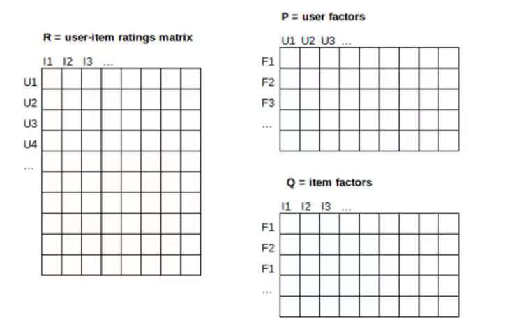
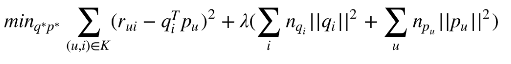
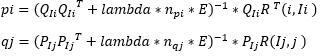
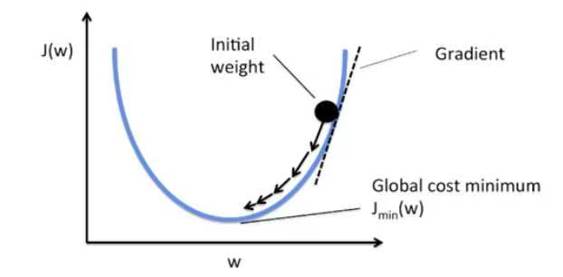
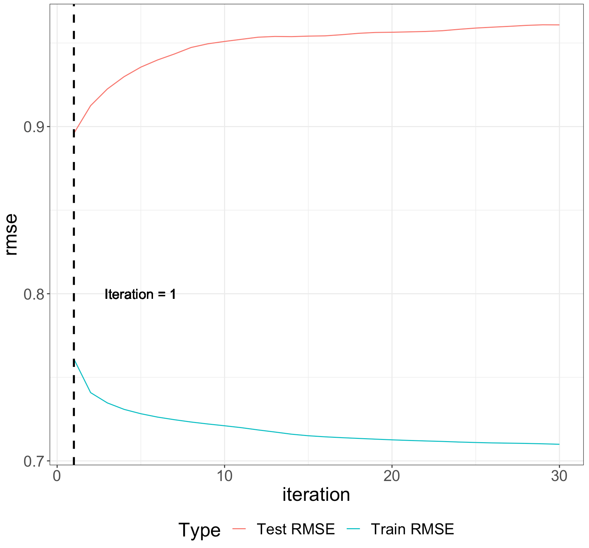
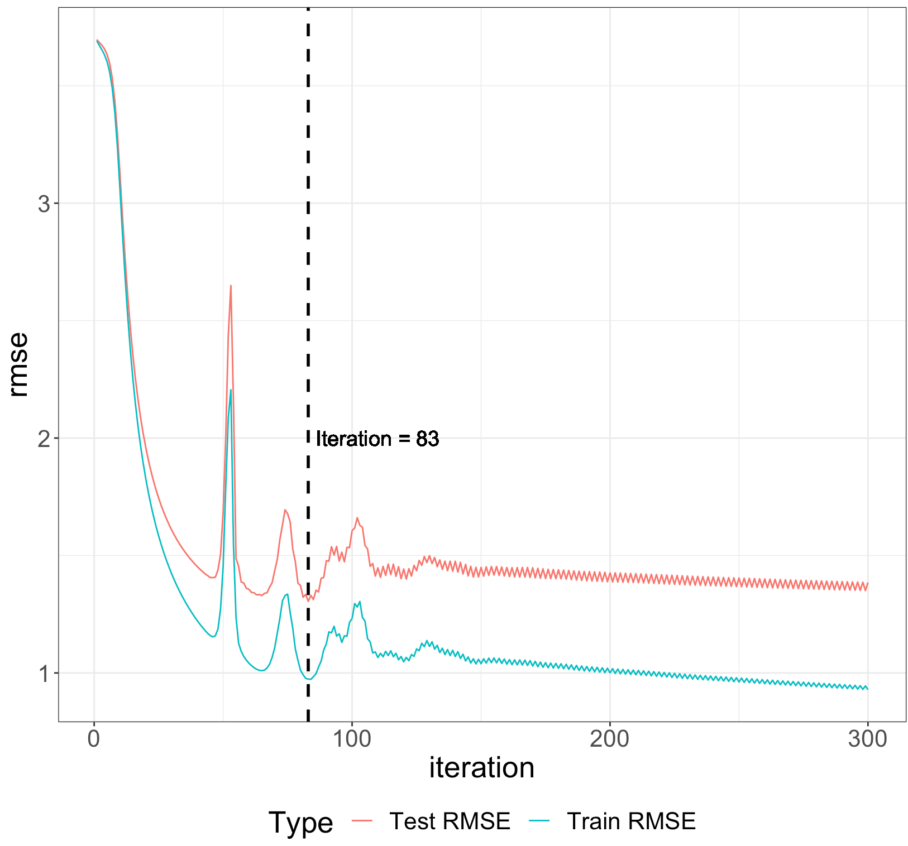
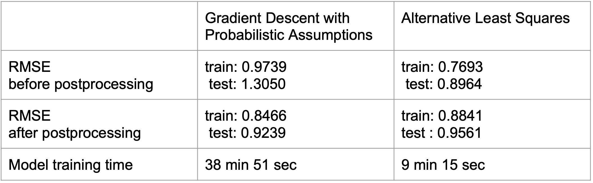

```{r setup, include=FALSE}
knitr::opts_chunk$set(echo = TRUE)
```
## Overview


####In this project, we use the rating data from netflix to do matrix factorization in order to recommend movies to different users.
####The methods we are using in this project are alternating least squares and Gradient Descent with Probabilistic Assumption. We also use kernel ridge regression as our post processing to improve the prediction accuracy.


## Recommendation System: Matrix Factorization

Recommendations can be generated by a wide range of algorithms. While user-based or item-based collaborative filtering methods are simple and intuitive, matrix factorization techniques are usually more effective because they allow us to discover the latent features underlying the interactions between users and items. Of course, matrix factorization is simply a mathematical tool for playing around with matrices, and is therefore applicable in many scenarios where one would like to find out something hidden under the data.

The idea behind matrix factorization is to capture patterns in rating data in order to learn certain characteristics, aka latent factors that describe users and items. In the picture below, these factors are stored in two matrices, P - user factors and Q - item factors. Let’s imagine that items are movies that users have rated. For movies, those factors might measure obvious dimensions such as the amount of action or comedy, orientation towards children, less well defined dimensions such as depth of character development or quirkiness; or completely uninterpretable dimensions. For users, each factor measures how much the user likes movies that score high on the corresponding movie factor.



For a given item i, the elements of (column) $q_i$ measure the extent to which the item possesses factors, positive or negative. For a given user u, the elements of $p_u$ measure the extent of interest the user has in items that are high on the corresponding factors, again, positive or negative. The resulting dot product, $p^T_u* q_i$, captures the interaction between the user u and item i - the user’s overall interest in the item’s characteristics. This estimates the user u’s rating of item i, which is denoted by $r_{ui}$. Our goal is to find the best possible estimates for all existing ratings.


### Step 1 Load Data and Train-test Split
```{r,eval = FALSE}
library(dplyr)
library(tidyr)
library(ggplot2)
data <- read.csv("../data/ml-latest-small/ratings.csv")
set.seed(0)
test_idx <- sample(1:nrow(data), round(nrow(data)/5, 0))
train_idx <- setdiff(1:nrow(data), test_idx)

data_train <- data[train_idx,]
data_test <- data[test_idx,]
data_train<-data_train[,1:3]
data_test<-data_test[,1:3]
ratingmean<-c()

U <- length(unique(data$userId))
I <- length(unique(data$movieId))
```

### ALS model

Because both qi and pj are unknowns, the J function is not convex. However, if we fix one of the unknowns, the optimization problem becomes quadratic and can be solved optimally (using normal equation). Thus, ALS technique rotates between fixing qi 's and pu's. When all pu's are fixed, the system recomputes the qi's by solving a least-squares problem, and vice versa. Again, this is an iterative process, but suitable  for parallelization. For example, in  ALS the system computes each pu independently of the other user factors (so we can solve normal equations for different users in parallel). The same holds for calculating item factors.

#### Steps:
#### * In Alternating Least Square model, our goal is to find user matrix(p) and movie matrix(q) minimizing an objective function.

{width=400px}

#### * First we generate user matrix(p) and movie matrix(q) in random. 
#### * One iteration: Fix q, solve p. Then fix p, solve q

{width=400px}

```{r,eval = FALSE}
source("../lib/function.R")
for(t in 1:I)
{ratingmean[t]=mean(data_train[data_train$movieId==as.character(sort(unique(data$movieId),
                                                                       decreasing = FALSE))[t],]$rating)}
res1 <- als(max.iter = 1,feature = 2, lambda = 0.01, data=data,train=data_train, test=data_test)
save(res1, file = "../output/A3.Rdata")
```


```{r,include=FALSE}
load("../output/A3.Rdata")
res1$train_RMSE
res1$test_RMSE
```

As we can see, the train RMSE is 0.7693 , test RMSE is 0.8964. Both of them are improved comparing with sample code.


### PMF model
To minimize the cost function:

$$J(P_{u1}, P_{u2}, \cdots, q_{i1}, q_{i2}, \cdots) = \sum_{r_{u, i} \in S}(p^T_u * q_i - r_{u, i})^2 + \lambda_u * \sum_u ||p_u||^2 + \lambda_i * \sum_i ||q_i||^2$$

where $||.||$ is the Euclidean norm, and $S$ is the set of all existing ratings. Note that the formula includes a regularization part (with lambda coefficient). The system learns the model by fitting the previously observed ratings, but the goal is to generalize those previous ratings in a way that predicts future, unknown ratings. Thus, the system should avoid overfitting the observed data by regularizing the learned parameters, whose magnitudes are penalized. The lambda constants controls the extent of regularization and is usually determined by cross-validation.

#### Use gradient descent of cost function

Let’s imagine that the cost function $J$ is dependent on one variable $(w)$ as shown in the image below. In order to find a minimum gradient descent algorithm can be used as follows: We can start with randomly chosen value for w - initial weight. Calculate the gradient of J for the current w value and update w using the gradient. This way, the value of cost function J for updated w is closer to minimum. Repeat these steps until convergence.(In our case, since our cost function is not coverge, we can only get local minimum)



The above example can be generalized to the case when J depends on multiple variables, i.e. $P$ and $Q$ factors. First, initialize all factors to small random values. Then, find the local minimum by using:

* gradient descent, as explained above

However, in case when the number of ratings is large, it might be slow since calculating the gradient of J is expensive (it contains summation over all ratings). The exact formulas for calculating gradients and parameter updates are shown below: for each parameter, a corresponding gradient is multiplied by learning rate and add from the current parameter value. (Note that the gradients below are of J/2, so if we want to be precise this would be the optimization of J/2). 

$$p_u = p_u + learning \space rate *(\sum_{r_{u, i} \in S}(r_{u, i} - p^T_u * q_i)*q_i - \lambda_u * p_u)$$
$$q_i = q_i + learning \space rate *(\sum_{r_{u, i} \in S}(r_{u, i} - p^T_u * q_i)*p_u - \lambda_u * q_i)$$
```{r,eval = FALSE}
source("../lib/function.R")

pmf_result <- foreach(i = 1, .combine = rbind ) %dopar% {
    outSub <-  update_PMF(f = 5, lambdap = 0.001, lambdaq = 0.1,
                      lrate = 0.001, max.iter = 100, stopping.deriv = 0.1,
                      data = data, train = data_train, test = data_test)
    outSub
}
```


### CV for tune parameter, do not run!

#### als CV
```{r,eval = FALSE}
source("../lib/function.R")
lambda_list <- seq(0.01, 0.05, 0.04)
feature_list <- seq(2, 3, 1)
f_l <- expand.grid(feature_list, lambda_list)

als_result_summary <- array(NA, dim = c(nrow(f_l), 4)) 
run_time <- system.time(for(i in 1:nrow(f_l)){
  par <- paste("feature = ", f_l[i,1], ", lambda = ", f_l[i,2])
  cat(par, "\n")
  current_result <- cv.function(data_train, K = 5, feature = f_l[i,1], lambda = f_l[i,2])
  als_result_summary[i,] <- unlist(current_result) 
  print(als_result_summary)
  
})

save(als_result_summary, file = "../output/rmse.Rdata")
```

{width=600px}


As it is shown in the graph, if we increase the iterations, training RMSE goes down while testing RMSE goes up, which means we are overfitting. So we choose the iteration number as 1. Best parameters in cv is $(f = 2, \lambda = 0.01)$.


#### pmf CV
```{r}

f_list <- c(1, 2, 3, 4, 5, rep(5, 6), rep(10, 3), 15, 15, 20, 20)
lq_list <- c(rep(0.001, 5), 0.010, 0.100, 0.001, 0.010, 0.100, 0.001, 0.001, 0.010, 0.100, 0.010, 0.001, 0.010, 0.001)
lp_list <- c(rep(0.001, 5), 0.010, 0.100, 0.010, 0.001, 0.001, 0.100, 0.001, 0.010, 0.100, 0.010, 0.001, 0.010, 0.001)
f_ll <- cbind(f_list, lq_list, lp_list)

knitr::kable(f_ll, digit = 3)
```


```{r,eval = FALSE}
library(parallel) # one of the core R packages
library(doParallel)

library(foreach)
library(iterators)

nCores <- detectCores()
registerDoParallel(nCores) 
system.time(
pmf_result_summary <- foreach(i = 1:nrow(f_ll), .combine = rbind ) %dopar% {
    outSub <-  cv.function(data = data, dat_train = data_train, K = 5, f = f_ll[i,1], lq = f_ll[i,2], lp = f_ll[i,3], max.iter = 20, lrate = 0.001)
    outSub
}
)

save(pmf_result_summary, file = "../output/cv.Rdata")
```


{width=600px}

As it is shown in the graph, for PMF, best iteration number is 83. Best parameters in cv is $(f = 5, \lambda_p = 0.001, \lambda_q = 0.1)$.


###Postprocessing based on als

#### In post-processing part, we user kernel ridge regression to improve its prediction accuracy.
{width=250px}

#### Use train data to do kernel ridge regression, then predict, we get a new train RMSE and test RMSE.

```{r,eval = FALSE}
library(kernlab)
source("../lib/function.R")
load('../output/A3.Rdata')

#A3 rbf kernel ridge regression
rbf<-rbfdot(sigma=0.05)
Y_kernel_rbf<-y_hat_kernel(res1[['q']],rbf,lambda=0.01, f=2,data_train = data_train,data_test = data_test)

#RMSE
true_train<-data_train[order(data_train$userId),]$rating
sqrt(sum((Y_kernel_rbf[[1]][,"rating"] - true_train)^2)/length(true_train)) 

true_test<-data_test[order(data_test$userId),]$rating
sqrt(sum((Y_kernel_rbf[[2]][,"rating"] - true_test)^2)/length(true_test)) 
```

Before postprocessing, our accuracy for train and test datasets are 0.7693 and 0.8964. After postprocessing, our accuracy for train and test datasets are 0.8841 and 0.9561 which means our algorithms works well and we do not need postprocessing for Alternative Least Squares algorithms.


###Postprocessing based on pmf

```{r,eval=FALSE}
library(kernlab)
source("../lib/function.R")

load("../output/a2_result.Rdata")

#A2 rbf kernel ridge regression
rbf<-rbfdot(sigma=0.05)
Y_kernel_rbf<-y_hat_kernel(A2_result$q,rbf,lambda=0.01, f=5,data_train = data_train,data_test = data_test)

#RMSE
true_train<-data_train[order(data_train$userId),]$rating
sqrt(sum((Y_kernel_rbf[[1]][,"rating"] - true_train)^2)/length(true_train)) 

true_test<-data_test[order(data_test$userId),]$rating
sqrt(sum((Y_kernel_rbf[[2]][,"rating"] - true_test)^2)/length(true_test)) 
```

Before postprocessing, our accuracy for train and test datasets are 0.974 and 1.305. After postprocessing, our accuracy for train and test datasets are 0.847 and 0.924, which means after kernel ridge regression, the accuracy of PMF has improved a lot.


### Evaluation

```{r,eval=FALSE}
t1 <- system.time(als(max.iter = 1,feature = 2, lambda = 0.01, data=data,train=data_train, test=data_test))
t2 <- system.time(foreach(i = 1, .combine = rbind ) %dopar% {
    outSub <-  update_PMF(f = 5, lambdap = 0.001, lambdaq = 0.1,
                      lrate = 0.001, max.iter = 100, stopping.deriv = 0.1,
                      data = data, train = data_train, test = data_test)
    outSub
})
#system time
t1
t2
#RMSE
res1$train_RMSE
res1$test_RMSE
A2_result$train_RMSE
A2_result$test_RMSE
```

#{width=800px}

From the RMSE table above, we can see the RMSEs for Gradient Descent with Probabilistic Assumption for both train and test are larger than the RMSEs for Alternative Least Squares and the model training time for Gradient Descent with Probabilistic Assumption is very long compared with the model training time for Alternative Least Squares. 

After doing post processing, we can see the RMSEs for Gradient Descent with Probabilistic Assumption for both train and test have a obvious improvement while the RMSEs for Alternative Least Squares for both train and test becomes worse than before doing post processing. 

Overall, the best RMSEs for both train and test is to do Alternative Least Squares without post processing.